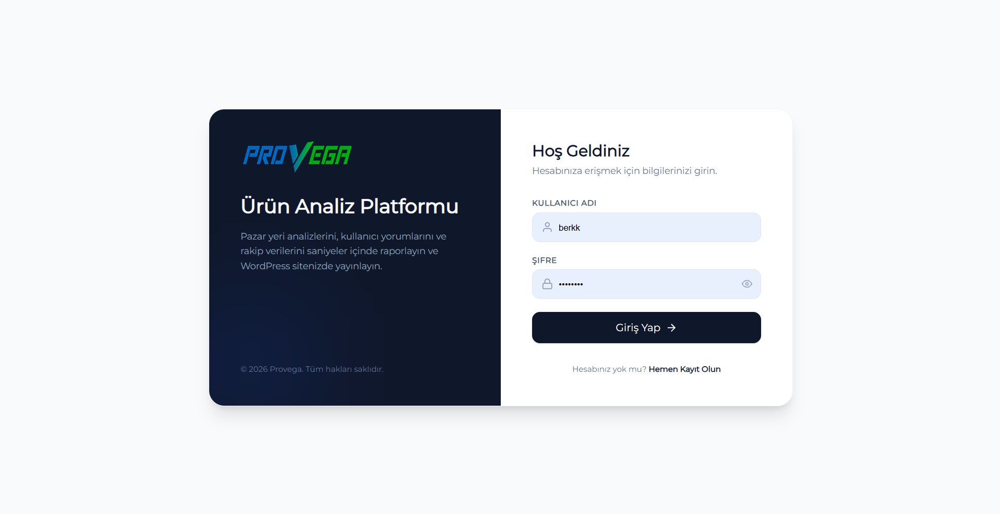
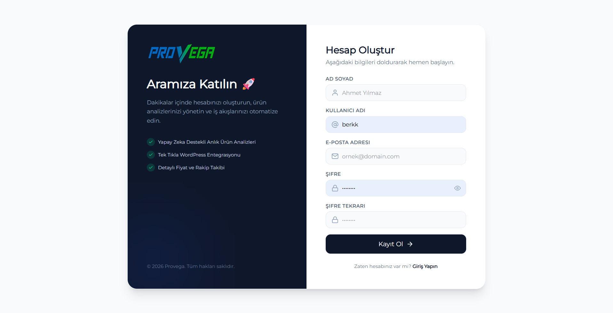
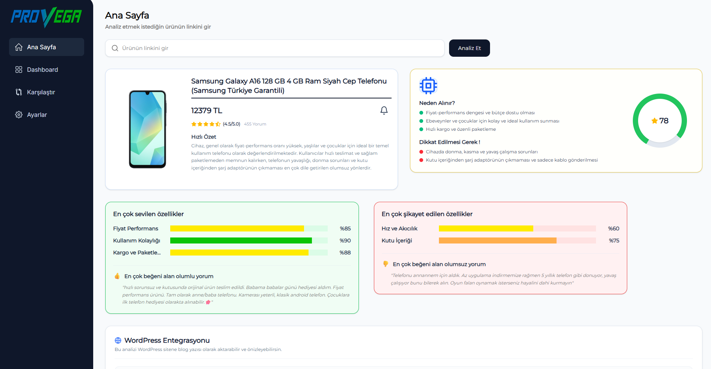
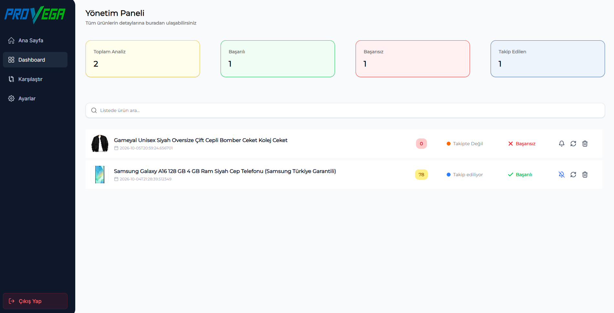
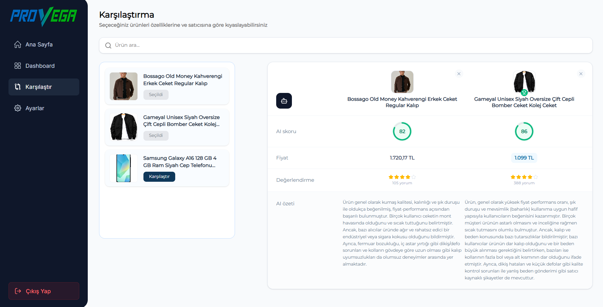
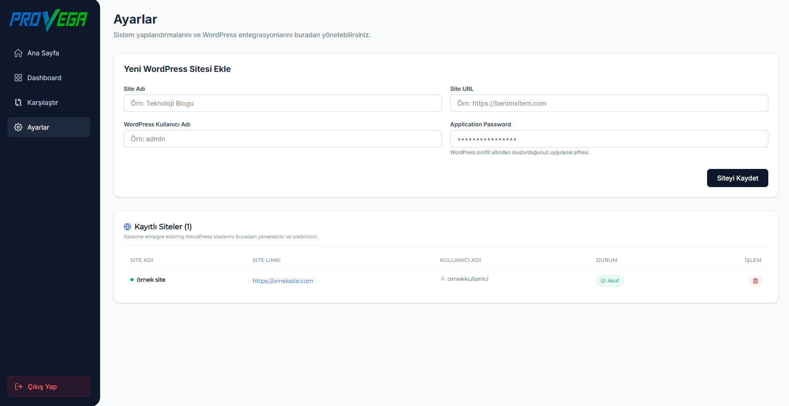
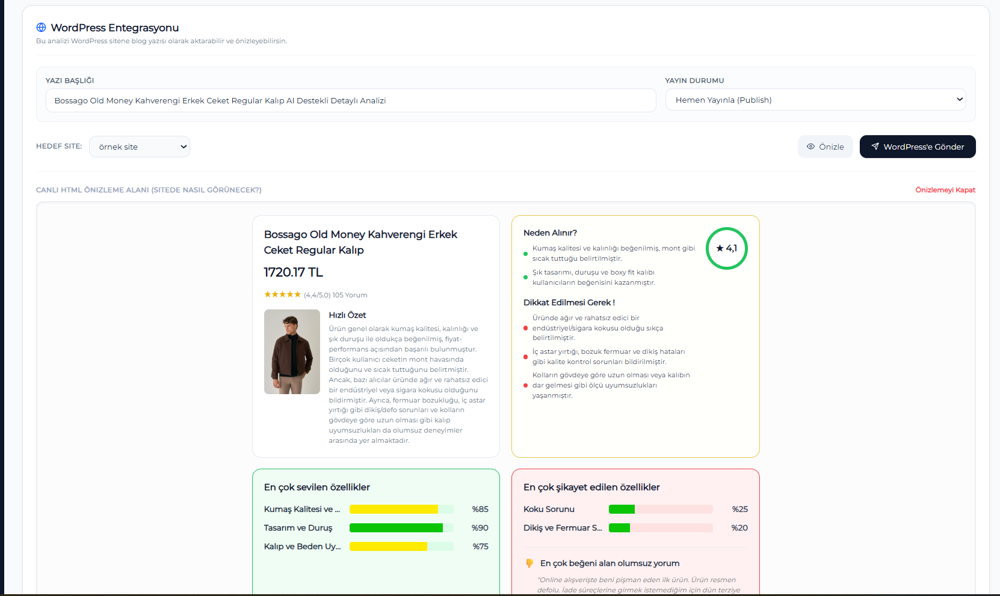

# 🚀 AI Product Analysis

### Yapay zekâ destekli e-ticaret ürün analiz ve karşılaştırma platformu

Vega, e-ticaret ürünlerini kullanıcı yorumları üzerinden **yapay zekâ ile analiz eden**, ürünleri karşılaştırmayı ve oluşturulan analizleri **WordPress'e doğrudan aktarmayı** sağlayan full-stack bir platformdur.

> Ürün URL'sini gir → Ürün bilgilerini çek → Yorumları analiz et → AI içgörülerini keşfet → Ürünleri karşılaştır → İçeriği WordPress'te yayınla.

---

## ✨ Özellikler

- 🤖 **AI Destekli Ürün Analizi** — Google Gemini ile kullanıcı yorumlarının analiz edilmesi
- 🛒 **Otomatik Ürün Verisi** — Trendyol ürün bilgilerinin JSOUP ile çekilmesi, trendyolun sağlamış olduğu api'den yorumların çekilmesi
- 📊 **Sentiment Analizi** — Ürün özelliklerinin olumlu/olumsuz değerlendirilmesi
- ⭐ **AI Ürün Skoru** — Yorumlara dayalı ürün değerlendirmesi
- 🔍 **Ürün Karşılaştırma** — 2 ürünü analiz sonuçlarıyla karşılaştırma
- 📈 **Dashboard** — Analiz edilen ürünleri ve istatistikleri yönetme
- ❤️ **Ürün Takibi** — İlgilenilen ürünleri takip edebilme
- 🌐 **WordPress Entegrasyonu** — AI analizlerini WordPress'te otomatik olarak yayınlama
- 🔐 **JWT Authentication** — Access & Refresh Token tabanlı kimlik doğrulama
- 🔒 **Güvenli Credential Saklama** — WordPress bilgileri şifrelenerek saklanır
- ⚡ **Asenkron AI İşlemleri** — Uzun süren analizlerin background'da çalıştırılması
- 🧪 JUnit 5 + Mockito ile unit testler

---

## 🧠 Nasıl Çalışıyor?

```text
Ürün URL'si
     │
     ▼
┌──────────────┐
│   Scraping   │
└──────┬───────┘
       ▼
Ürün + Yorumlar
       │
       ▼
┌──────────────┐
│  Gemini AI   │
└──────┬───────┘
       ▼
┌──────────────────────┐
│ AI Skoru             │
│ Ürün Özeti           │
│ PRO / CON Analizi    │
│ Özellik Sentiment'i  │
└──────────┬───────────┘
           │
     ┌─────┴─────┐
     ▼           ▼
 Dashboard   WordPress
```

## ⚙️ Analiz Süreci

1. Kullanıcı ürün URL'sini gönderir.
2. Ürün bilgileri Trendyol'dan alınır.
3. Durum PENDING olarak güncellenir.
4. Ürünün yorumları API üzerinden toplanır.
5. Yorumlar filtrelenir ve analiz için hazırlanır.
6. Analiz background task olarak başlatılır.
7. Google Gemini yorumları analiz eder.
8. Başarılı analiz PENDING durumundan SUCCESS durumuna çekilir, başarısız olanlar FAILED yapılır.
9. AI sonucu PostgreSQL'e kaydedilir.
10. Frontend analiz durumunu polling ile takip eder.
11. Sonuç dashboard üzerinde gösterilir.
12. Kullanıcı isterse analizi WordPress'te yayınlar.

---

## 🛠️ Teknolojiler

### Frontend

- **React 19**
- **Vite**
- **React Router**
- **Tailwind CSS**
- **Fetch API**

### Backend

- **Java 21**
- **Spring Boot**
- **Spring Security**
- **Spring Data JPA**
- **PostgreSQL**
- **Spring AI**
- **Google Gemini**
- **Jsoup**
- **JJWT**
- **MapStruct**
- **Maven**
- **JUnit5/Mockito**

### Entegrasyonlar

- 🛍️ Trendyol 
- 🤖 Google Gemini
- 🌐 WordPress REST API

---

## 🏗️ Mimari

```text
                  ┌─────────────────┐
                  │    React App     │
                  │   React + Vite   │
                  └────────┬────────┘
                           │ REST API
                           ▼
                  ┌─────────────────┐
                  │   Spring Boot   │
                  │                 │
                  │ Security        │
                  │ Services        │
                  │ AI              │
                  │ Scraper         │
                  └───────┬─────────┘
                          │
              ┌───────────┼───────────┐
              ▼           ▼           ▼
        PostgreSQL    Google Gemini  WordPress
```

---

## 📁 Proje Yapısı

```text
provega/
├── frontend/        # React uygulaması
│   ├── src/
│   │   ├── components/
│   │   ├── pages/
│   │   ├── services/
│   │   └── hooks/
│   └── package.json
│
├── backend/         # Spring Boot API
│   ├── src/
│   │   └── main/
│   │       └── java/
│   │           ├── controller/
│   │           ├── service/
│   │           ├── repository/
│   │           ├── model/
│   │           ├── dto/
│   │           ├── ai/
│   │           ├── scrapper/
│   │           └── jwt/
│   └── pom.xml
│
└── README.md
```

---

## ⚡ Kurulum

### Gereksinimler

- Java 21+
- Node.js 18+
- PostgreSQL
- Google Gemini API Key

### Backend

```bash
cd backend

./mvnw spring-boot:run
```

Windows:

```bash
mvnw.cmd spring-boot:run
```

Backend:

```text
http://localhost:8080
```

### Frontend

```bash
cd frontend

npm install
npm run dev
```

Frontend:

```text
http://localhost:5173
```

---

## 🔐 Environment Variables

Secret bilgileri repository içerisinde tutmayın.

Örnek:

```env
SPRING_DATASOURCE_URL=jdbc:postgresql://localhost:5432/provega
SPRING_DATASOURCE_USERNAME=postgres
SPRING_DATASOURCE_PASSWORD=********

GOOGLE_GENAI_API_KEY=********

JWT_SECRET_KEY=********
APP_ENCRYPTION_SECRET=********
```

---

## 🌐 WordPress Entegrasyonu

Vega, oluşturduğu AI analizlerini WordPress REST API üzerinden doğrudan yayınlayabilir.

```text
AI Analizi
    ↓
HTML oluşturma
    ↓
Preview
    ↓
WordPress REST API
    ↓
Yeni Post
```

WordPress Application Password bilgileri güvenli şekilde şifrelenerek saklanır.

---

## 🔐 Authentication

Kimlik doğrulama sistemi:

- JWT Access Token
- Refresh Token
- BCrypt Password Hashing
- Protected Routes
- Automatic Token Refresh

üzerine kuruludur.

---

## 📸 Ekran Görüntüleri

| Giriş | Kayıt Ol |
|---|---|
|  |  |

| Ana Sayfa | Dashboard |
|---|---|
|  |  |

| Ürün Karşılaştırma | Ayarlar |
|---|---|
|  |  |

| Wordpress |
|---|
|  |

---

## 👨‍💻 Geliştirici

**Berkay Kömür**


